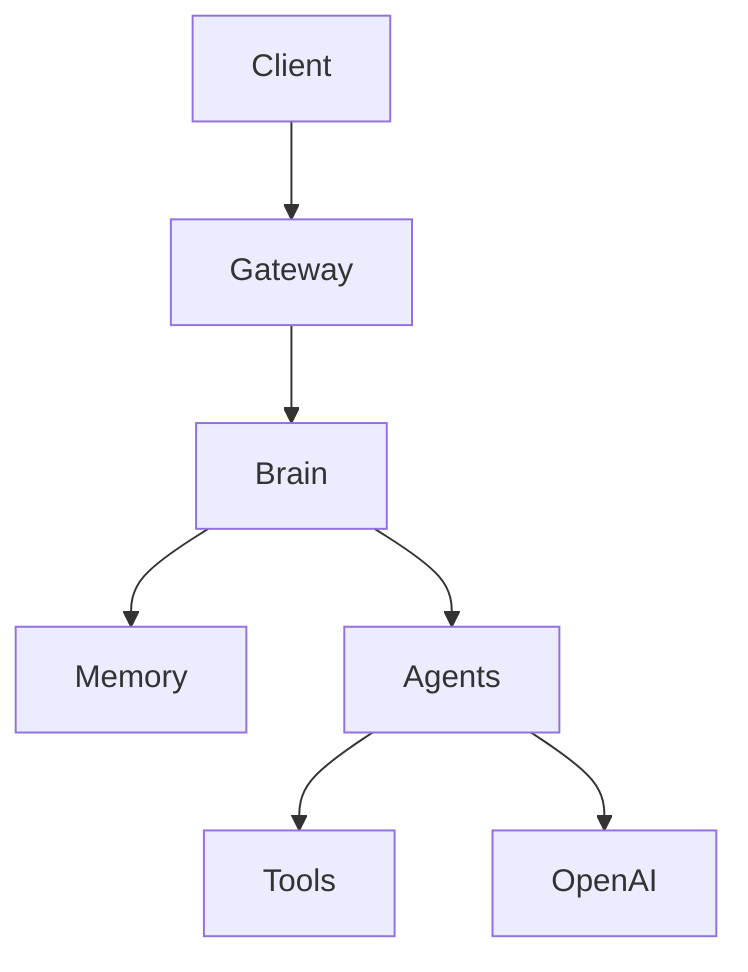

# Vittusha AI Platform - Sprint 2 Memory Engine

Node.js + Express service that receives Telegram messages, routes them into the Vittusha Brain, replies through Telegram, and stores conversations, memories, and approval-gated tasks in PostgreSQL or Supabase.

## Features

- Telegram webhook handling.
- Telegram chat allowlist with `TELEGRAM_ALLOWED_CHAT_ID`.
- OpenAI Responses API integration.
- Brain Foundation with a central `processMessage()` contract.
- ExecutiveAgent as the default agent.
- Channel layer for send/receive only.
- Sprint 2 Memory Engine for user, conversation, fact, preference, project, business, language, objective, and custom memories.
- Context builder that injects relevant memories, recent messages, preferences, projects, goals, business, language, and current conversation into OpenAI prompts.
- Memory scoring by importance, freshness, usage, confidence, and relevance.
- Automatic memory extraction after full user/assistant turns.
- Intent detection for `greeting`, `question`, `task`, `research`, `action`, and `conversation`.
- Task planner for approval-gated actions.
- Placeholder tool registry for Gmail, Google Maps, HubSpot, browser, and calendar.
- Phase 5 Light proactive assistant with suggestions.
- Automatic language detection with priority: Haitian Creole, French, English.
- Replies in the user's detected or dominant language, defaulting to Haitian Creole.
- Editable system prompt in `src/prompts/system-prompt.md`.
- PostgreSQL/Supabase persistence with detected language stored per conversation.
- No Gmail, Google Maps, HubSpot, CRM, or dashboard code.

## Project Structure

```text
src/
  app.js                    Express routes
  server.js                 Runtime entrypoint
  config.js                 Environment configuration and phone allowlist
  db.js                     PostgreSQL connection pool
  agents/
    ExecutiveAgent.js        Default Sprint 1 agent
  ai-core/
    agent.js                Legacy AI Core entrypoint kept for compatibility
    openai-client.js        OpenAI API call and prompt assembly
  brain/
    Brain.js                Central Brain with processMessage()
    BrainPipeline.js        Message lifecycle orchestration
    ContextBuilder.js       Language and memory context loading
    IntentDetector.js       Simple intent classifier
    ResponseGenerator.js    OpenAI-backed response generation
  channels/
    ChannelGateway.js       Gateway interface: receive/send/typing/acknowledge
    ChannelGatewayRegistry.js
    MetaWhatsAppCloudGateway.js
                             Legacy dormant Meta/WhatsApp gateway, not loaded at runtime
    WhatsAppGateway.js      Legacy placeholder, intentionally unused
    whatsapp.js             Legacy dormant WhatsApp helpers, not loaded at runtime
    telegram/
      TelegramGateway.js    Telegram normalization gateway for the target channel
  memory/
    ConversationMemory.js   Brain-facing memory facade
    MemoryService.js        Public Memory Engine API
    MemoryRepository.js     JSON memory provider with optional dormant PostgreSQL support
    MemoryExtractor.js      Automatic memory extraction
    MemoryRetriever.js      Relevant memory retrieval
    MemoryScorer.js         Importance/freshness/usage/confidence/relevance scoring
    MemoryDirectAnswer.js   Direct answers from known memory when possible
    MemoryContextBuilder.js Structured prompt context builder
    MemoryTypes.js          Canonical memory type list
    README.md               Memory module documentation
    memory-store.js         Legacy memory helpers kept for compatibility
  prompts/system-prompt.md  Editable assistant behavior prompt
  proactive-engine.js       Pending work analysis and daily summaries
  scheduler/checkin.js      Legacy dormant check-in scheduler, not loaded at runtime
  services/
    conversations.js        Database writes
    language.js             Language detection helper
  shared/
    logger.js               Shared logger export
  suggestions.js            Suggestion lifecycle persistence
  tasks/
    task-planner.js         Approval-gated task creation
  tools/
    ToolRegistry.js         Tool registry class wrapper
    registry.js             Placeholder tool registry
sql/schema.sql              Database schema
sql/migrations/             Incremental database migrations
.env.example                Required environment variables
```

## Sprint 1 Architecture

The channel does not own AI logic anymore. The HTTP server does not know OpenAI and does not call agent code. It receives a webhook, identifies the channel, resolves the matching gateway, and hands off the payload.

```text
Webhook
  -> Channel Gateway
  -> Brain.processMessage({
       tenantId,
       userId,
       channel,
       conversationId,
       message,
       metadata
     })
  -> BrainPipeline
  -> ContextBuilder
  -> IntentDetector
  -> ExecutiveAgent
  -> ResponseGenerator
  -> OpenAI client
  -> Channel response
```



`Brain.processMessage()` returns:

```text
{
  reply,
  actions,
  logs
}
```

Current MVP runtime supports Telegram only. Meta/WhatsApp modules are legacy dormant code and are not loaded at startup.

Technical comment: this architecture keeps all channel-specific concerns outside the Brain. A future Web App, public API, Discord bot, Slack app, or Mobile App only needs a gateway that implements:

- `receive()`
- `send()`
- `typing()`
- `acknowledge()`

Once a new gateway converts its native payload into the Brain message contract, the Brain, Memory, Agents, Tools, and OpenAI response path remain unchanged. This is the reason new channels can be added without modifying the Brain.

## Sprint 2 Memory Engine

The Brain no longer depends only on the current message. Before each OpenAI call, it asks the Memory Engine to build a scoped conversation context.

Memory flow:

```text
Incoming message
  -> Brain
  -> ContextBuilder
  -> MemoryService.buildConversationContext()
  -> MemoryRetriever.findRelevantMemories()
  -> MemoryScorer
  -> MemoryContextBuilder
  -> ResponseGenerator
  -> OpenAI
  -> MemoryService.recordConversationTurn()
  -> MemoryExtractor
  -> MemoryRepository.saveMemory()
```

Memory types:

- `PERSON`
- `PROJECT`
- `BUSINESS`
- `PREFERENCE`
- `OBJECTIVE`
- `FACT`
- `TASK`
- `LOCATION`
- `LANGUAGE`
- `RELATION`
- `CONTACT`
- `CUSTOM`

The Memory Engine exposes:

- `saveMemory()`
- `searchMemory()`
- `updateMemory()`
- `archiveMemory()`
- `deleteMemory()`
- `findRelevantMemories()`
- `buildConversationContext()`

The OpenAI prompt receives these sections:

- Current User
- Relevant Memories
- Recent Messages
- Preferences
- Projects
- Goals
- Business
- Language
- Current Conversation

Embeddings and future RAG are prepared through `memory_embeddings`, `memory_tags`, and `memory_links`, but vector retrieval is intentionally not implemented yet.

Direct memory answers are supported for known facts. For example, after `Je développe Vittusha AI.`, the question `Quel projet je développe ?` is answered from memory as `Vous développez Vittusha AI.` instead of asking the user to repeat.

Project memory extraction recognizes French and Haitian Creole variants such as `Je développe Vittusha AI`, `Map devlope Vittusha AI`, `M ap devlope Vittusha AI`, and `Je travaille sur Vittusha AI`.

Memory diagnostic logs include `memory_extracted`, `memory_extracted_type`, `memory_stored`, `memories_retrieved`, `memory_context_created`, `context_injected`, `memory_direct_answer_match`, `memory_direct_answer_failed_reason`, and `memory_used`.

## Sprint Quality Gate

Every sprint must include:

- Unit tests for isolated rules and services.
- Integration tests across Brain, Memory, Agents, and repositories.
- E2E tests that simulate the real Telegram behavior.

The required E2E memory regression is:

```text
User: Je développe Vittusha AI.
User: Quel projet je développe ?
Expected: Vous développez Vittusha AI.
```

This E2E test must fail if OpenAI is called for the second message. A sprint is not considered complete until this E2E test passes.

## Temporary Debug Routes

Debug routes are disabled by default. They are available only when:

```bash
DEBUG_ROUTES_ENABLED=true
```

Inspect memory state for a Telegram chat:

```bash
curl https://your-domain.example/debug/memory/1989082524
```

Run the same Brain pipeline used by Telegram:

```bash
curl -X POST https://your-domain.example/debug/brain-test \
  -H "Content-Type: application/json" \
  -d '{"chatId":"1989082524","message":"Quel projet je développe ?"}'
```

The debug response reports retrieved memories, the direct-memory answer result, whether OpenAI was called, and the final reply.

## Setup

1. Install dependencies:

```bash
npm install
```

2. Create your environment file:

```bash
cp .env.example .env
```

3. Fill in `.env`:

- `OPENAI_API_KEY`: your OpenAI API key.
- `OPENAI_MODEL`: default is `gpt-4.1-mini`.
- `TELEGRAM_BOT_TOKEN`: Telegram bot token used by `/webhook/telegram`.
- `TELEGRAM_ALLOWED_CHAT_ID`: Telegram chat id allowed to use the MVP.
- `DEBUG_ROUTES_ENABLED`: set to `true` only temporarily for production diagnosis.
- `DATABASE_URL`: optional PostgreSQL or Supabase Postgres connection string for future activation.
- `PGSSL`: use `true` for Supabase-hosted Postgres, usually `false` for local Postgres.

4. Optional PostgreSQL setup:

PostgreSQL is dormant for the current Telegram MVP runtime. If `DATABASE_URL` is not configured, Vittusha still starts, serves `/health`, uses the JSON memory provider, and keeps the Telegram Memory Engine active.

To prepare PostgreSQL for a future activation:

```bash
psql "$DATABASE_URL" -f sql/schema.sql
```

For Supabase, you can also paste `sql/schema.sql` into the Supabase SQL editor.

If you already created the first MVP schema, apply the migration instead:

```bash
psql "$DATABASE_URL" -f sql/migrations/001_agent_architecture.sql
psql "$DATABASE_URL" -f sql/migrations/002_phase_5_light_suggestions.sql
psql "$DATABASE_URL" -f sql/migrations/003_memory_engine.sql
```

5. Start the server:

```bash
npm run dev
```

Production:

```bash
npm start
```

Run syntax checks:

```bash
npm run check
```

Run tests:

```bash
npm test
```

## PM2 Operations

Restart the production process:

```bash
pm2 restart vittusha-ai
```

Inspect logs:

```bash
pm2 logs vittusha-ai
```

Useful PM2 commands:

```bash
pm2 status
pm2 describe vittusha-ai
pm2 monit
```

The Brain logs these lifecycle events:

- `message_received`
- `memory_loaded`
- `intent_detected`
- `agent_selected`
- `openai_called`
- `response_generated`
- `response_sent`

## Telegram Webhook

Expose your local server with a tunnel such as ngrok:

```bash
ngrok http 3000
```

Configure Telegram to call:

- Webhook URL: `https://your-domain.example/webhook/telegram`

## Endpoints

- `GET /health`: health check.
- `POST /webhook/telegram`: receives Telegram updates and routes them through `TelegramGateway -> Brain -> Memory Engine -> DirectMemoryAnswer -> OpenAI fallback`.

## Language Behavior

The service detects language before calling OpenAI:

- Haitian Creole: replies in Haitian Creole.
- French: replies in French.
- English: replies in English.
- Mixed language: replies mainly in the dominant detected language.
- Unclear language: defaults to Haitian Creole.

## Brain and Agent Architecture

The messaging channel is only a communication boundary. It parses incoming text, checks the approved user, stores the conversation shell, calls the Brain, sends the returned reply, and updates the conversation record.

The Brain receives:

- `tenantId`
- `userId`
- `channel`
- `conversationId`
- `message`
- `metadata`

It returns a structured response:

- `reply`
- `answer`
- `intent`
- `agent`
- `actions`
- `memories`
- `logs`

`answer` remains as a temporary compatibility alias for existing code paths. New gateways should read `reply`.

All messages currently pass through `ExecutiveAgent`. Memory, tool detection, task planning, and OpenAI response generation happen behind the Brain boundary, not inside the channel.

## Memory System

The `memories` table stores long-term facts per phone number. The system seeds core memories such as:

- Preferred language: Haitian Creole
- User is Vital-Herne Zephy
- User manages STS-Haiti and ProSpace Community
- Never send external actions without approval

The current MVP can also store simple user-provided memories from messages beginning with phrases like `remember that`.

`ConversationMemory` also loads recent conversation turns from PostgreSQL using the existing `conversations` table. If PostgreSQL is unavailable during local development, it falls back to an in-memory buffer capped at 20 messages per conversation.

## Task Planner

The `tasks` table stores approval-gated tasks with:

- `title`
- `description`
- `status`
- `steps`
- `created_at`

Supported statuses are `pending`, `approved`, `running`, `completed`, and `cancelled`.

Important rule: the assistant creates a pending task when a placeholder external tool would be needed. It does not execute the action.

## Tool Manager

The tool registry lives in `src/tools/registry.js`.

Current placeholder tools:

- `gmail`
- `google_maps`
- `hubspot`
- `browser`
- `calendar`

No real Gmail, Google Maps, HubSpot, browser, or calendar APIs are implemented yet.

## Proactive Assistant

Phase 5 Light adds suggestions. The agent can notice pending work, blocked tasks, unapproved tasks, pending suggestions, and recent conversations. It can suggest next actions, but it cannot execute external actions.

Telegram commands:

- `Kisa m dwe fè jodi a?`
- `Montre m suggestions yo`
- `Apwouve suggestion 1`
- `Ignore suggestion 1`
- `Complete suggestion 1`

Suggestion statuses:

- `pending`
- `approved`
- `dismissed`
- `completed`

Suggestion priorities:

- `low`
- `medium`
- `high`

You can edit assistant behavior anytime in:

```text
src/prompts/system-prompt.md
```

## Database

Each approved incoming Telegram message creates conversation and memory records through the Brain and Memory Engine.

Important columns:

- `user_message`
- `assistant_reply`
- `detected_language`
- `channel`
- `agent_response`
- `tool_needed`
- `task_id`
- `status`
- `raw_payload`

Additional tables:

- `memories`
- `tasks`
- `suggestions`

Unauthorized Telegram chat ids are rejected before OpenAI and database writes.

## Verification

Run syntax checks and unit tests:

```bash
npm run check
npm test
```

## Deployment Notes

- Use HTTPS for the public webhook URL.
- Keep `.env` out of git.
- Use a long-lived Meta access token in production.
- Set `PGSSL=true` for Supabase.
- Deploy behind a process manager or platform that restarts failed Node processes.
